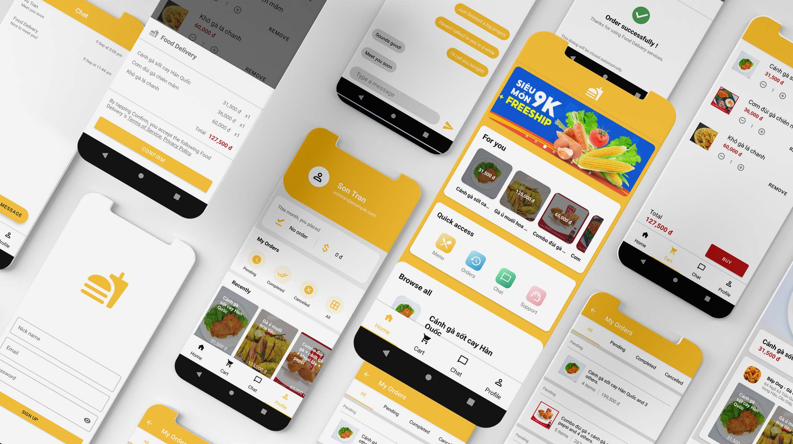

## Food Delivery for Android
Food Delivery is a sample project, you can fork and customize to make your awesome application. This repo contains all source code and config files to make your app. This application using [flaskApi](https://github.com/vutran1305/flaskApi).

## Documentations
To make your application, you **must** prepare :

- Backend server using [flaskApi](https://github.com/vutran1305/flaskApi).
- Firebase project with authentication and realtime database ready.

### Setup your flaskApi server

First, you need to clone [flaskApi](https://github.com/vutran1305/flaskApi) to your server. You can install Flask and run it by following step (using Ubuntu):

- Install python3 and python3-venv packages
```console
$ apt install python3 python3-venv
```
- Go to flaskApi folder
```console
$ cd flaskApi
```
- Start using virtual environment
```console
$ source venv/Scripts/activate
```
- Launch server (you can append --host=0.0.0.0 to below command to make server publicly)
```console
$ flask run
```
### Setup Firebase

Then you add **google-services.json** configuration file to [app](/app) folder

#### Config Realtime database rules

This is a sample rule you can use to make private your database
```json
{
    "rules": {
        "conversations": {
            ".read": true,
            ".write": true
        },
        "users": {
            "$uid": {
                ".read": "auth != null",
                ".write": "auth != null"
            },
            "7HCgAB8qWLeF0fG4M8rTzVn3Isg1": {
                ".read": true,
                ".write": true
            }
        }
    }
}
```